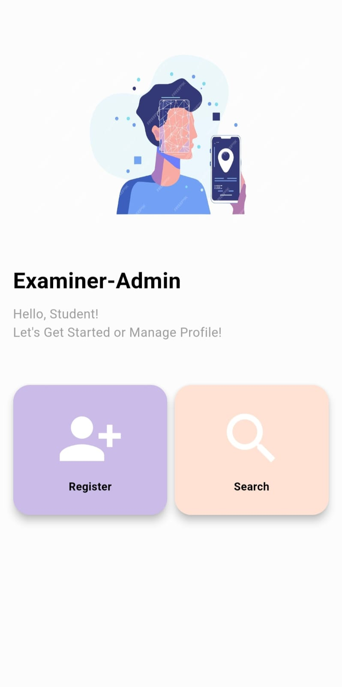
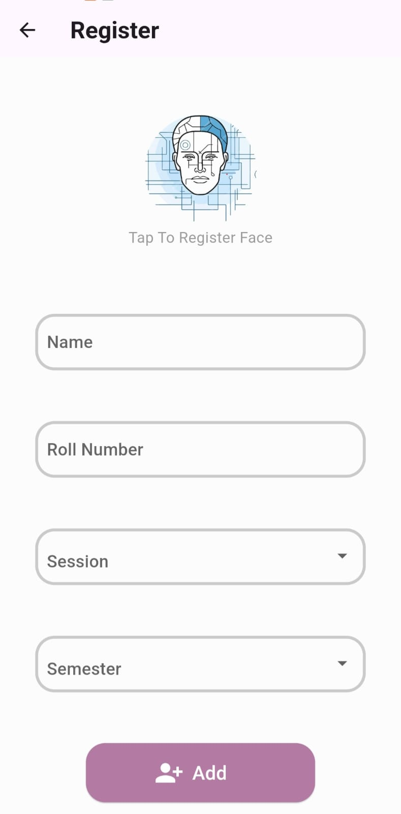
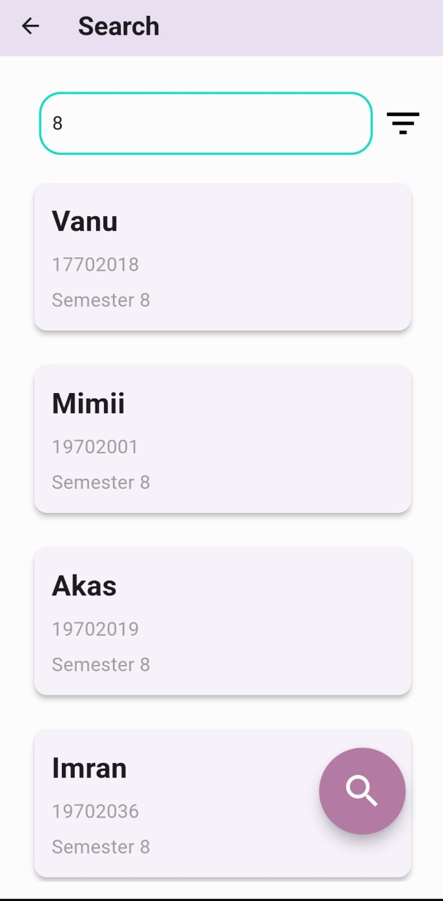
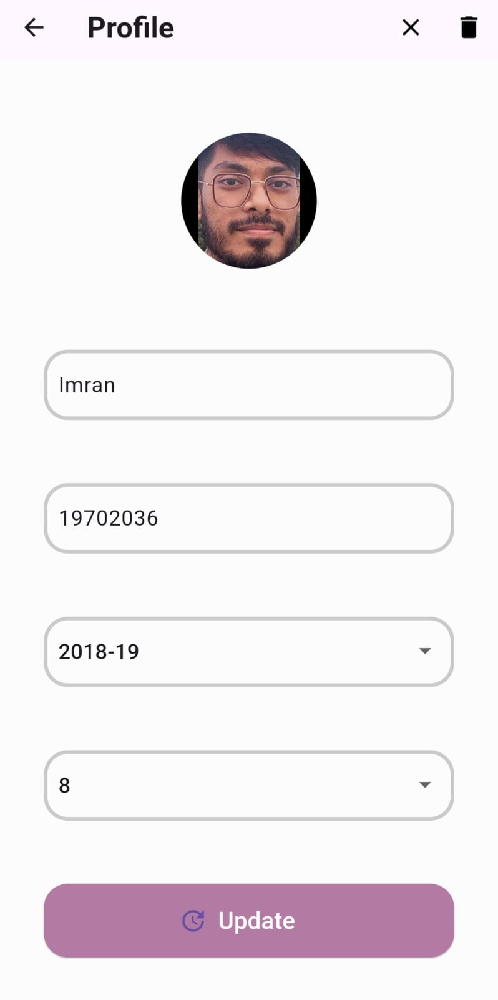

# Examiner-Admin App

The Examiner-Admin app is part of the Examiner project developed for Department of Electrical and Electronic Engineering, University of Chittagong, designed to register students and manage their profiles efficiently using facial recognition technology. This app allows authorities to register students, search for students, and update or delete profiles with face embedding data stored securely in a database.

## Features

1. **Student Registration:**
    - Students can register by providing their name, roll number, session, and semester.
    - The app captures a facial image, which is pre-processed into face embeddings. These embeddings are stored along with the student’s information in the database.

2. **Student Search:**
    - Authorities can search for students based on their roll number or semester.
    - By selecting the semester filter, authorities can retrieve a list of all students in that semester.
    - For individual student details, they can search using the roll number filter.

3. **Student Profile:**
    - Each student's profile includes all the registered details and can be updated or deleted.
    - In case of a profile picture update, the new facial image is processed, and new face embeddings are generated and stored in the database.

## Screenshots

- **Home**
  

- **Student Registration**
  

- **Student Search By Semester**
  

- **Student Search By Roll**
  

- **Student Profile**
  

## Technologies Used

- **TensorFlow Lite (FaceNet):**  
  TensorFlow Lite is a lightweight version of TensorFlow optimized for mobile and embedded devices. It runs the facial recognition model FaceNet, which is used to generate face embeddings by analyzing the student's facial image. These embeddings, which are unique representations of the student's face, are computed locally on the device and then stored in the backend. TensorFlow Lite allows the app to perform facial recognition efficiently on mobile devices without relying on server-side processing.

- **Django:**  
  Django is a high-level Python web framework that encourages rapid development and clean, pragmatic design. It is used as the backend server for the Examiner-Admin app. The Django REST framework provides the APIs for managing student information, storing face embeddings, and communicating with the mobile app. Django also handles authentication and permissions, ensuring secure access to student data.

- **MySQL:**  
  MySQL is a relational database management system used to store structured data such as student information (name, roll number, session, semester) and their associated face embeddings. It serves as the primary storage for the Examiner-Admin app's backend, enabling efficient retrieval and updates of student profiles.
